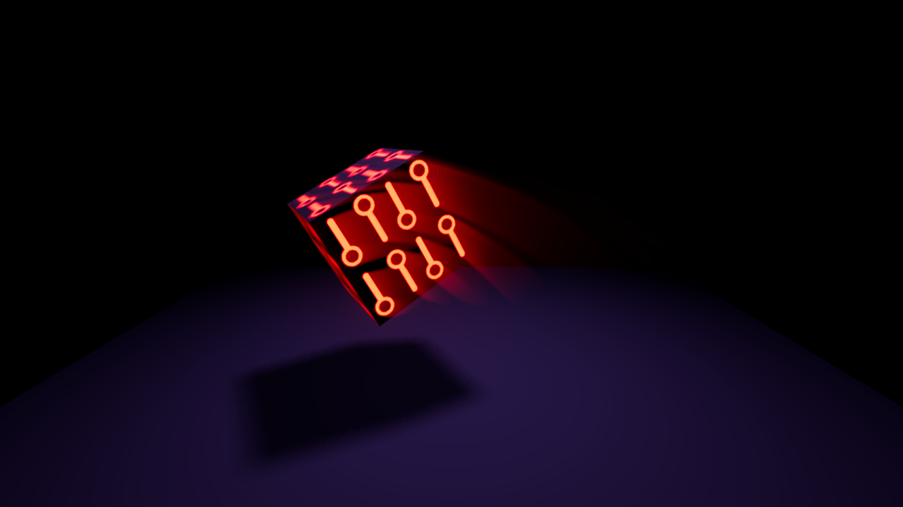

# compositor-effect-trails
Compute shader generating VHS light trails for the brightest points on screen for Godot 4.4. Simple 2-buffer effect, doesn't use velocity vectors. Allows for tweaking persistence and decay, as well as blending mode. Works only in Forward+ renderer.

